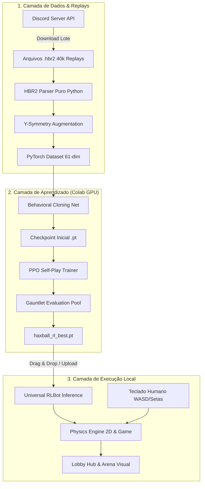

# ⚽ HaxBall AI Studio: Arquitetura do Sistema, Protocolo HBR2 e Pipeline de Aprendizado

Este documento contém a especificação técnica completa, matemática e arquitetural do ecossistema **HaxBall AI Studio**, abrangendo o motor de física 2D, decodificador de replays `.hbr2`, pipeline de Behavioral Cloning (Imitação), PPO Self-Play (Aprendizado por Reforço), espaço de estados em 61 dimensões e interface gráfica de batalha.

---

## 📑 Sumário

1. [Visão Geral e Arquitetura do Sistema](#1-visão-geral-e-arquitetura-do-sistema)
2. [Motor de Física 2D e Mecânicas de Jogo](#2-motor-de-física-2d-e-mecânicas-de-jogo)
3. [Especificação do Protocolo Binário HBR2](#3-especificação-do-protocolo-binário-hbr2)
4. [Espaço de Observações (61 Dimensões com Visão Completa)](#4-espaço-de-observações-61-dimensões-com-visão-completa)
5. [Espaço de Ações e Mapeamento Bijetivo (18 Classes)](#5-espaço-de-ações-e-mapeamento-bijetivo-18-classes)
6. [Pipeline de Behavioral Cloning (Imitação de 40k Replays)](#6-pipeline-de-behavioral-cloning-imitação-de-40k-replays)
7. [Função de Recompensa Limpa (Prevenção de Reward Hacking)](#7-função-de-recompensa-limpa-prevenção-de-reward-hacking)
8. [Aprendizado por Reforço: PPO e Self-Play Simétrico](#8-aprendizado-por-reforço-ppo-e-self-play-simétrico)
9. [Interface Gráfica (Lobby Hub & Arena 1v1)](#9-interface-gráfica-lobby-hub--arena-1v1)
10. [Notebooks de Treinamento no Google Colab](#10-notebooks-de-treinamento-no-google-colab)

---

## 1. Visão Geral e Arquitetura do Sistema

O sistema é modular e desacoplado, permitindo que o mesmo motor execute simulações em tempo real com interface gráfica Pygame ou rode em modo *headless* a mais de **10.000 passos por segundo** em servidores e no Google Colab.



---

## 2. Motor de Física 2D e Mecânicas de Jogo

### 2.1. Equações de Movimento e Integração Euleriana
A física do jogo opera em $60\text{ FPS}$ ($\Delta t = 1/60\text{ s}$) por passo de simulação:

$$\vec{p}_{t+1} = \vec{p}_t + \vec{v}_t$$
$$\vec{v}_{t+1} = (\vec{v}_t + \vec{a}_t) \times d$$

Onde:
- $\vec{p}$ é o vetor posição $\begin{bmatrix} x \\ y \end{bmatrix}$.
- $\vec{v}$ é o vetor velocidade linear.
- $\vec{a}_t$ é a aceleração induzida pelo input do teclado ($|\vec{a}| = 0.1\text{ px/frame}^2$ para jogadores).
- $d$ é o coeficiente de amortecimento (*damping* / atrito com o solo):
  - Jogadores: $d_{\text{player}} = 0.96$
  - Bola de Futsal: $d_{\text{ball}} = 0.99$

### 2.2. Colisão Elástica Disco-Disco (Jogador $\leftrightarrow$ Bola)
Quando a distância euclidiana $\|\vec{p}_1 - \vec{p}_2\| \le r_1 + r_2$:
1. O vetor normal de colisão é: $\hat{n} = \frac{\vec{p}_1 - \vec{p}_2}{\|\vec{p}_1 - \vec{p}_2\|}$
2. A velocidade relativa normal é: $v_{\text{rel}} = (\vec{v}_1 - \vec{v}_2) \cdot \hat{n}$
3. O impulso elástico escalar é calculado por:
   $$J = \frac{-(1 + e) \cdot v_{\text{rel}}}{\frac{1}{m_1} + \frac{1}{m_2}}$$
   Onde $e$ é o coeficiente de restituição ($bCoef$). No Futsal clássico, $e_{\text{player}} = 0.0$ (condução inelástica colada no pé) e $e_{\text{wall}} = 1.25$ (tabela rápida na parede).

### 2.3. Mecânica de Chute (*Kick Rate-Limit*)
- Raio de alcance do chute: $r_{\text{kick}} = r_{\text{player}} + r_{\text{ball}} + 4.0\text{ px}$.
- Quando a tecla de chute é ativada dentro do raio:
  $$\vec{v}_{\text{ball}} \leftarrow \vec{v}_{\text{ball}} + \hat{n}_{\text{kick}} \times v_{\text{kick\_power}}$$
- O impulso do chute aplica $v_{\text{kick\_power}} \approx 5.5\text{ px/frame}$ direcionado do centro do jogador para a bola.

---

## 3. Especificação do Protocolo Binário HBR2

Os replays oficiais do HaxBall (`.hbr2`) são arquivos binários ultracompactos com o seguinte cabeçalho:

| Offset (Bytes) | Tipo | Descrição |
|---|---|---|
| `0x00 - 0x03` | `ASCII` | Mágico fixo `b"HBR2"` |
| `0x04 - 0x07` | `uint32_be` | Versão do protocolo de gravação |
| `0x08 - 0x0B` | `uint32_be` | Tamanho do payload descompactado |
| `0x0C ...` | `Binary` | Fluxo bruto compactado em `zlib Deflate` (Window size `-15`) |

### 3.1. Descompactação e Leitura de Tipos Primitivos
O payload interno utiliza codificação **VarInt** (Variable-Length Quantity de 7 bits por byte) e números de ponto flutuante em Big-Endian:
- **VarInt:** lê bytes sequenciais enquanto o bit mais significativo ($0x80$) estiver ativo.
- **Sync Table:** Tabela de deltas de tempo por frame.
- **Player Input Bitmask:**
  - Bit 0 ($0x01$): Esquerda (Left)
  - Bit 1 ($0x02$): Direita (Right)
  - Bit 2 ($0x04$): Cima (Up)
  - Bit 3 ($0x08$): Baixo (Down)
  - Bit 4 ($0x10$): Chute (Kick)

---

## 4. Espaço de Observações (61 Dimensões com Visão Completa)

A observação é **100% invariante à perspectiva** (o agente sempre enxerga seu time atacando para a direita $+X$) e contém todas as informações da tela que um jogador humano visualiza.

### Vetor de 61 Dimensões:

```
[ Globais & Bola (8) ] + [ Jogador Ego (8) ] + [ Companheiros (20) ] + [ Oponentes (25) ]
```

| Bloco | Índices | Features | Normalização |
|---|---|---|---|
| **Globais & Bola** | `0 - 7` | $X_{\text{bola}}, Y_{\text{bola}}, V_{x,\text{bola}}, V_{y,\text{bola}}$, Dist. Gol Rival, Dist. Próprio Gol, Saldo Gols, Tempo | $W=450, H=200, V_{\max}=15$ |
| **Jogador Ego** | `8 - 15` | $X_{\text{ego}}, Y_{\text{ego}}, V_{x,\text{ego}}, V_{y,\text{ego}}, \Delta X_{\text{bola}}, \Delta Y_{\text{bola}}$, Distância Bola, Flag Chute | $W=450, H=200, \text{CanKick} \in \{0, 1\}$ |
| **Companheiros** | `16 - 35` | 4 slots $\times$ 5 features ($\Delta X, \Delta Y, V_x, V_y, \text{ativo}$) ordenados por proximidade | Slots inativos recebem $0.0$ |
| **Oponentes** | `36 - 60` | 5 slots $\times$ 5 features ($\Delta X, \Delta Y, V_x, V_y, \text{ativo}$) ordenados por proximidade | Slots inativos recebem $0.0$ |

---

## 5. Espaço de Ações e Mapeamento Bijetivo (18 Classes)

Para garantir que a rede neural comande o jogador com máxima fidelidade, o espaço de ações discretas utiliza uma matriz de $3 \times 3$ direções combinadas com o estado binário de chute:

### Fórmula de Codificação:
$$\text{ActionIndex} = (y_{\text{idx}} \times 3 + x_{\text{idx}}) + (9 \times \text{kick})$$

Onde $x_{\text{idx}}, y_{\text{idx}} \in \{0, 1, 2\}$ correspondendo a $\{-1, 0, +1\}$.

### Fórmula de Decodificação Bijetiva:
$$\text{dir} = \text{ActionIndex} \pmod 9$$
$$x_{\text{idx}} = \text{dir} \pmod 3 \implies mx = x_{\text{idx}} - 1$$
$$y_{\text{idx}} = \lfloor \text{dir} / 3 \rfloor \implies my = y_{\text{idx}} - 1$$
$$\text{kick} = (\text{ActionIndex} \ge 9)$$

Se $mx \ne 0$ e $my \ne 0$, a velocidade diagonal é normalizada por $\frac{1}{\sqrt{2}} \approx 0.7071$.

---

## 6. Pipeline de Behavioral Cloning (Imitação de 40k Replays)

O treinamento supervisionado por imitação extrai milhões de transições reais $(s_t, a_t)$ dos replays `.hbr2`:

1. **Filtro de Qualidade:** Dá preferência e maior peso estatístico para as decisões tomadas pelo time vencedor da partida.
2. **Data Augmentation com Simetria Vertical (Y-Axis Mirroring):**
   Para cada frame $(x, y, v_x, v_y, \text{ação})$, o gerador cria o estado espelhado $(x, -y, v_x, -v_y, \text{ação}_{\text{espelhada}})$. Isso dobra o tamanho do dataset e elimina qualquer viés direcional entre a parede superior e inferior.
3. **Arquitetura da Rede (`HaxBallExpertPolicy`):**
   $$\text{MLP: } 61 \xrightarrow{\text{Linear}} 256 \xrightarrow{\text{LayerNorm + ReLU}} 256 \xrightarrow{\text{LayerNorm + ReLU}} 256 \xrightarrow{\text{ReLU}} 128 \xrightarrow{\text{Linear}} 18\text{ Logits}$$
4. **Otimização:**
   - Loss: Cross-Entropy Loss com `AdamW` ($\text{LR} = 10^{-3}$, Weight Decay $= 10^{-4}$).
   - Learning Rate Scheduler: `CosineAnnealingLR`.

---

## 7. Função de Recompensa Limpa (Prevenção de Reward Hacking)

Para evitar que a IA desenvolva comportamentos viciosos (como ficar batendo bola na parede sem objetividade), a função de recompensa é estritamente orientada a **resultados competitivos**:

$$R_t = R_{\text{gol}} + R_{\text{perseguição}} + R_{\text{progressão}} + R_{\text{alinhamento}}$$

```python
# 1. Recompensa Esparsa (Gol Marcado / Sofrido)
if goal_scored:
    return +10.0 if scoring_team == agent_team else -10.0

# 2. Recompensa Densa de Perseguição
reward += (prev_dist_to_ball - curr_dist_to_ball) * 0.05

# 3. Recompensa Densa de Progressão da Bola ao Gol Rival
to_goal_dir = (target_goal - ball.pos).normalized()
ball_goal_speed = ball.speed.dot(to_goal_dir)
if ball_goal_speed > 0:
    reward += ball_goal_speed * 0.08

# 4. Alinhamento de Chute
if kicked:
    alignment = to_ball_dir.dot(to_goal_dir)
    if alignment > 0:
        reward += alignment * 0.30
```

---

## 8. Aprendizado por Reforço: PPO e Self-Play Simétrico

### 8.1. Proximal Policy Optimization (PPO-Clip com GAE)
- **Função Objetivo Clippada:**
  $$L^{\text{CLIP}}(\theta) = \hat{\mathbb{E}}_t \left[ \min\left( r_t(\theta)\hat{A}_t, \, \text{clip}(r_t(\theta), 1-\epsilon, 1+\epsilon)\hat{A}_t \right) \right]$$
- **Generalized Advantage Estimation (GAE-$\lambda$):**
  $$\hat{A}_t = \sum_{l=0}^{\infty} (\gamma \lambda)^l \delta_{t+l}^V$$
  $$\delta_t^V = r_t + \gamma V(s_{t+1}) - V(s_t)$$

### 8.2. Currículo de Treinamento em 2 Fases
- **Fase 1 (Fundamentos - 100 Iterações):** O agente joga contra bots analíticos agressivos (`PressingBot` / `HeuristicBot`) para dominar controle de bola, interceptação e chute no gol.
- **Fase 2 (Self-Play Simétrico - 200 Iterações):** O oponente é substituído por checkpoints históricos da própria rede neural. Isso cria um ambiente dinâmico sem teto de habilidade, onde a IA aprende fintas, desarmes e contra-ataques.

---

## 9. Interface Gráfica (Lobby Hub & Arena 1v1)

A interface em Pygame (`main.py` / `haxball/ui/haxball_gui.py`) possui duas telas principais:

1. **Tela de Lobby (Hub de Batalha):**
   - **Coluna 1 (Modos):** 1v1 Duelo, 2v2 Futsal, 3v3 GLH, Gauntlet Challenge e Self-Play.
   - **Coluna 2 (Modelos & Bots):** Botão **"📤 Carregar Modelo .PT"**, cards com checkpoints salvos e lista de bots NPCs.
   - **Coluna 3 (Estádios):** Futsal 2v2 Arena, Micro 1v1 Arena, Futsal 3v3 GLH (7899), Classic e Big Stadium.
   - **Botão Central:** **`[ ▶ ENTRAR EM CAMPO (START) ]`**.
2. **Tela de Partida (Em Campo):**
   - Placar oficial, tempo de jogo, vetor de intenção do jogador e card de telemetria tática em tempo real (Pressão %, Alinhamento %, Distância e Ação Atual).
   - **Suporte a Drag & Drop:** Basta arrastar qualquer `.pt` do gerenciador de arquivos e soltar dentro da janela para plugar o modelo e jogar 1v1 na hora.

---

## 10. Notebooks de Treinamento no Google Colab

| Notebook | Objetivo | Arquivo |
|---|---|---|
| **Behavioral Cloning (Imitação)** | Download dos replays do Discord, parser `.hbr2`, data augmentation e treino supervisionado. | [`notebooks/train_haxball_bc_colab.ipynb`](file:///home/usuario/develop/reinforcement-cases/notebooks/train_haxball_bc_colab.ipynb) |
| **RL do Zero (PPO & Self-Play)** | Treinamento autônomo por reforço com ambiente vetorizado, gráficos ao vivo de convergência e Gauntlet. | [`notebooks/train_haxball_rl_from_scratch_colab.ipynb`](file:///home/usuario/develop/reinforcement-cases/notebooks/train_haxball_rl_from_scratch_colab.ipynb) |
