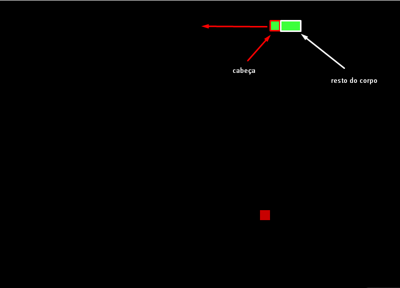
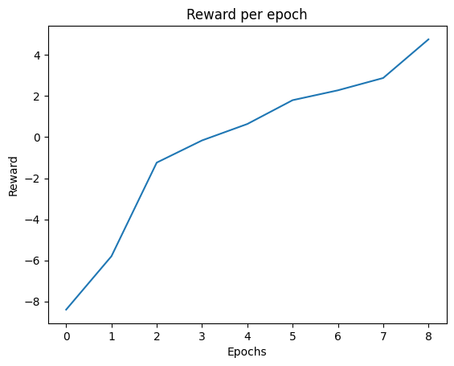
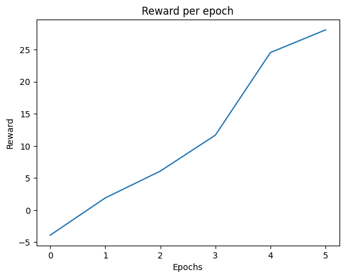
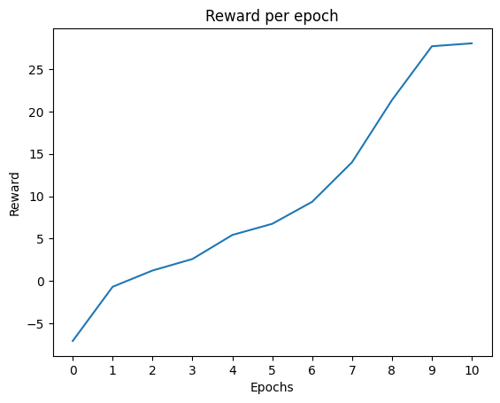
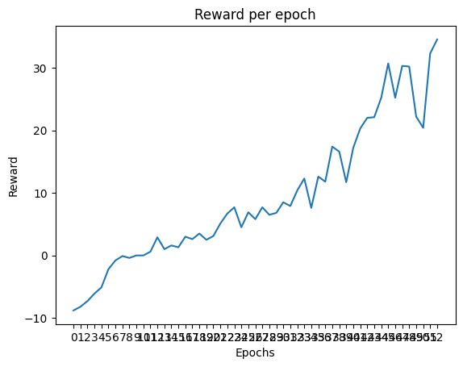
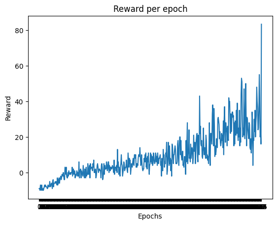

## Snake Game - Aprendizado por reforço
> (30/01)
O aprendizado por reforço é uma técnica de aprendizado de máquina que visa ensinar um agente a tomar decisões a partir de um estado e um  conjunto de ações possíveis, num determinado ambiente. Inicialmente, ele opta por aleatoriedade, mas com o tempo, ele aprende a tomar decisões melhores, baseadas em recompensas e punições.

Ou seja, num espectro filosófico, o Aprendizado por reforço simula o comportamento de um ser vivo. Por exemplo, um cachorro aprende a sentar quando recebe um petisco, e aprende a não latir quando é repreendido. 

O aprendizado por reforço é composto, inicialmente, por três elementos:
- **Agente**: O agente é o ser que toma as decisões. No nosso caso, o agente é a cobra.
- **Ambiente**: O ambiente é o local onde o agente toma as decisões. No nosso caso, o ambiente é o jogo da cobra.
- **Estado**: O estado é a situação atual do ambiente. No nosso caso, o estado é a posição da cobra, a posição da comida e a posição dos obstáculos.

Nesse projeto, o objetivo é ensinar um agente a jogar o jogo da cobrinha (snake) utilizando aprendizado por reforço.

### Implementando o jogo

Inicialmente, o jogo é implementado de forma simples usando o pygame. O jogo trabalha numa janela 800x600, onde cada célula do jogo é um quadrado de 20x20 pixels; Logo, o jogo pode ser interpretado como uma matriz 40x30.

A cobra possui o tamanho, que começa com 3 e aumenta conforme ela come a maçã, além disso ela possui uma direção. Resumindo os atributos da cobra:
- x: posição x da cabeça que varia de 0 a 800 (ou 0 a 39)
- y: posição y da cabeça que varia de 0 a 600 (ou 0 a 29)
- dx: direção x, que varia de -20 a 20 (ou -1,0,1)
- dy: direção y, que varia de -20 a 20 (ou -1,0,1)
- length: tamanho da cobra, que varia de 1 a N

Com a direção, é possível mapear a posição da cobra na matriz 40x30. Por exemplo, se a cobra está na posição (100,10) e a direção é (20,0), a próxima posição da cobra será (100-L,10), onde L é o tamanho da cobra. O sinal é negativo pois se a cobra se move para a direita, sua cabeça é a última célula da esquerda pra direita.



Dessa forma, podemos mapear a posição da cobra na matriz 40x30. Por consequinte, temos a nossa estrutura que representará o estado do jogo. Em cada célula da matriz, teremos:
- 0: célula vazia
- 1: corpo da cobra
- 2: cabeça da cobra
- 3: comida
  
Trabalhando nessa espécie de tabuleiro, também poderemos, posteriormente, adicionar obstáculos e mais coisas.

### Projetando o aprendizado
> (31/01)
Bem, queremos que nossa AISnake aprenda a jogar bem o jogo da cobrinha, ou seja, de forma otimizada, e isso quer dizer que ela deve se alimentar o mais rápido possível e não morrer. Para isso, precisamos definir as recompensas e punições que a cobra receberá.

#### Recompensas
- Comer a comida: +10
- Morrer: -10
- Se mover: -0.1
  
#### Jogo
O jogo troca de época quando a cobra morre ou quando uma determinada quantidade de movimentos é feita. 

Essa quantidade aumenta a cada 100 épocas. Dessa forma, conforme a cobra aprende, ela terá mais tempo para jogar e, consequentemente, mais tempo para aprender.

#### Implementação

A implementação foi feita em Python, utilizando o Pytorch como framework de aprendizado de máquina. O código foi dividido em partes:
- **Agent.py**: Define a classe do agente, que é a cobra.
- **game.py**: Define a classe do jogo, que é o ambiente.

O agente é treinado por meio de um algoritmo de aprendizado por reforço chamado Deep Q-Learning. Esse algoritmo é uma extensão do Q-Learning, que é um algoritmo de aprendizado por reforço que aprende a função Q, que é a função que mapeia o estado e a ação para uma recompensa.

Os hyperparâmetros iniciais do algoritmo são:
- Número total de episódios de treinamento: 50000
- Tamanho do lote para replay: 64
- Fator de desconto: 0.9
- Probabilidade de exploração: 1.0
- Valor mínimo de epsilon: 0.01
- Taxa de decaimento de epsilon: 0.9995
- Taxa de aprendizado: 0.001

Entretanto, foi encontrado dificuldades para treinar a cobra. O algoritmo não estava convergindo, e a cobra não estava aprendendo. 

```bash
Total epochs:  1516
Mean reward:  -7.083192612137203
```
> (01/02)

Depois de uma breve reflexão. Nossa matrix inclui todos os elementos, mas não inclui as bordas. Ou seja, como nossa cobra saberia que ela morre ao tocar na borda? Algo deve indicar isso para ela.
Logo, temos:
- 0: célula vazia
- 1: corpo da cobra
- 2: cabeça da cobra
- 3: comida
- 4: borda

Mudando o código, a matriz agora contempla as bordas. A cobra morre ao tocar na borda, e a recompensa é -10.
Também, eu decidi que as recompensam iam ser simplesmente 10 para comer a comida e -10 para morrer. A punição por se mover foi retirada. Ademais, não terá mais um limite de movimentos por época. A cobra jogará até morrer, o que, na minha intuição, indica que ela terá mais como denotar que as bordas são perigosas.


> (02/02)
Ainda assim, o algoritmo não convergiu. A cobra não aprendeu a jogar. 
O que será que está errado? O que fazer?

Bem, procurando por exemplos de RL com o Snake Game, notei que não estavam utilizando a matrix 40x30 Como o input. Na verdade, eles estavam utilizando dados como a direção da cobra, a posição da comida, e se eça estava perto de uma parede. 

Certo! Sem escolhas, irei tentar. Dessa forma, saberei se o problema é o algoritmo ou a representação do estado.

Mas antes, eu quis fazer um teste. No tutorial, eu notei que a cobra usava ações diferentes: ao invés do WASD, ela apenas tinhas as ações: Virar para a esquerda, virar para a direita e continuar em frente. Eu quis testar isso e ver o efeito. Ademais, eu restringi a janela para 400x300, para facilitar os testes como um todo.

Não melhorou muito, mas a cobra se movimentava de forma mais natural.

Implementando o novo estado, da seguinte forma:
```python
distance_to_food = np.sqrt((self.food_x - self.x) ** 2 + (self.food_y - self.y) ** 2) / (WIDTH + HEIGHT)
is_food_left = self.food_x < self.x
is_food_right = self.food_x > self.x
is_food_up = self.food_y < self.y
is_food_down = self.food_y > self.y
is_wall_left = self.x - BLOCK_SIZE < 0
is_wall_right = self.x + BLOCK_SIZE >= WIDTH
is_wall_up = self.y - BLOCK_SIZE < 0
is_wall_down = self.y + BLOCK_SIZE >= HEIGHT

state = [
    self.dx / BLOCK_SIZE,
    self.dy / BLOCK_SIZE,
    distance_to_food,
    is_food_left,
    is_food_right,
    is_food_up,
    is_food_down,
    is_wall_left,
    is_wall_right,
    is_wall_up,
    is_wall_down
]
return np.array(state)
```

Empiricamente, notei que o estado anterior não tratava um caso específico: Caso a cobra se "enrolasse" em si mesma, ela não saberia que estava fazendo tal, uma vez que a Matrix só ilustrava a cabeça e o corpo da cobra de forma reta; Certamente, isso estava influenciando negativamente.

Mas essa refatoração será feita depois, quando voltarmos ao estado de matrix (eu não vou desistir dela!). Por enquanto, vamos ver se a cobra aprende com esse novo estado.



Ótimo! Finalmente, a cobra aprendeu minimamente. 

Mas, assim como o estado anterior, esse novo estado não contempla a situação de a cobra se enrolar em si mesma. Ela faz algo e as vezes consegue comer cinco maçãs, mas outras vezes ela morre sem comer nenhuma.

Antes de fazer qualquer coisa, eis o resultado da troca de estado inicial:
```python
Total epochs:  5253
Mean reward:  9.023415191319247
```
A partir dessa época, o epsilon tendia a 0, o que significa que a cobra não estava mais explorando, mas sim, agindo de acordo com o que aprendeu. Ela chega a comer dez maçãs, mas ainda assim as vezes morre sem comer nenhuma. Isso é estranho.

Eis alguns gráficos:
Na escala de 1000 épocas:


Na escala de 500 épocas:


Na escala de 100 épocas:

E por fim, na escala de 10 épocas:


Certo, é esperado que ela tenha variabilidade, mas será que precisa ser tão variável? Ela morrer pela parede não é esperado.

Bem, Vamos mudar um pouco o estado:
```python
distance_to_food = np.sqrt((self.food_x - self.x) ** 2 + (self.food_y - self.y) ** 2) / (WIDTH + HEIGHT)
is_food_left = self.food_x < self.x
is_food_right = self.food_x > self.x
is_food_up = self.food_y < self.y
is_food_down = self.food_y > self.y
is_danger_left = any([self.x - BLOCK_SIZE == x and self.y == y for x, y in self.body[1:]])
is_danger_right = any([self.x + BLOCK_SIZE == x and self.y == y for x, y in self.body[1:]])
is_danger_up = any([self.y - BLOCK_SIZE == y and self.x == x for x, y in self.body[1:]])
is_danger_down = any([self.y + BLOCK_SIZE == y and self.x == x for x, y in self.body[1:]])
```

E, mexer um pouco nos hipermarametros:
Antes estavam assim:
```python
self.memory = deque(maxlen=10000)
self.gamma = 0.9  # Fator de desconto
self.epsilon = 1.0  # Probabilidade de exploração
self.epsilon_min = 0.01 # Valor mínimo de epsilon
self.epsilon_decay = 0.9995 # Taxa de decaimento de epsilon
self.learning_rate = 0.001 # Taxa de aprendizado
```

O epsilon decaía absurdamente lentamente; O Gamma podia estar alto, visto que queremos que a cobra se importe com o futuro, mas não tanto. O tamanho da memória podia ser maior,  e a taxa de aprendizado podia ser maior.

```python
self.memory = deque(maxlen=24000)
self.gamma = 0.85  # Fator de desconto
self.epsilon = 1.0  # Probabilidade de exploração
self.epsilon_min = 0.01 # Valor mínimo de epsilon
self.epsilon_decay = 0.999 # Taxa de decaimento de epsilon
self.learning_rate = 0.008 # Taxa de aprendizado
```
